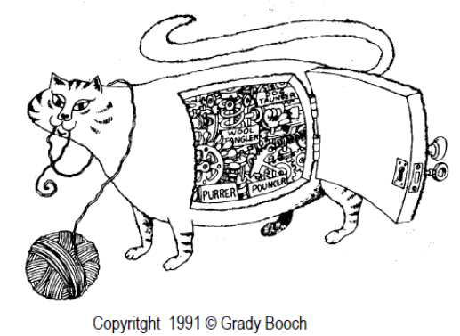

# Encapsulamento

Aprendemos anteriormente a criar Classes, para representar entidades do mundo, e cada classe tem uma série de atributos que representa suas características.
**Encapsulamento** trata de uma ponderação do desenvolvedor sobre quais informações (atributos e métodos) podem/devem ser visíveis à outras classes.
Portanto, podemos resumir que o encapsulamento tem basicamente dois objetivos:
1. **Esconder** aspectos de funcionamento de uma classe que, por alguma razão, não precisa ser acessível por outra classe.
2. Criar uma **abstração** que proveja **baixo acoplamento** entre diferentes classes de um programa.
3. **Proteger** o acesso a informações confidenciais e sensíveis de outras classes.

Algumas definições de Grady Booch (1991) que corroboram com os três pontos citados acima:
1. "*Encapsulamento* é o processo de *esconder todos os detalhes* de um objeto *que não contribuem* para suas características essenciais."
2. "*Nenhuma parte* de um sistema complexo *deve depender* dos *detalhes internos* das outras partes."

O que nos permite implementar encapsulamento nos programas são os modificadores de
